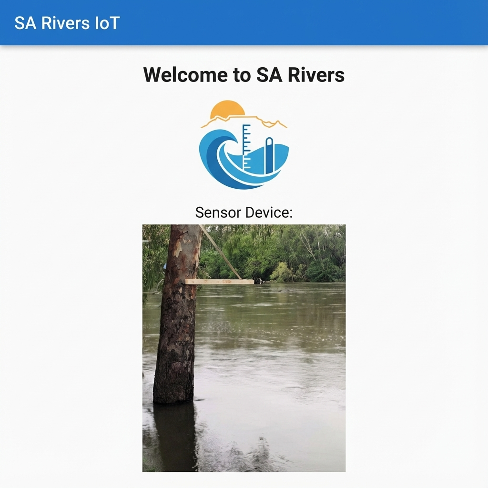
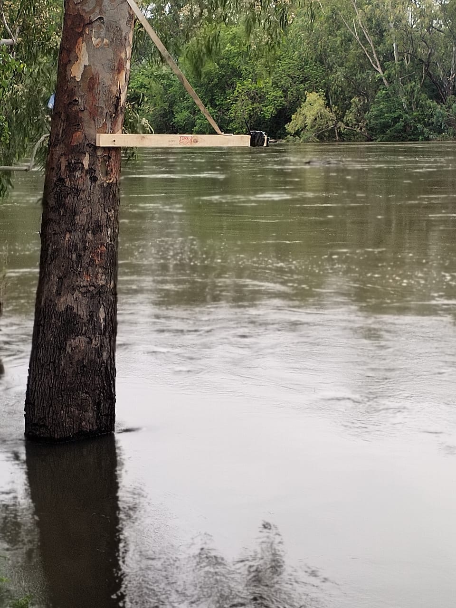
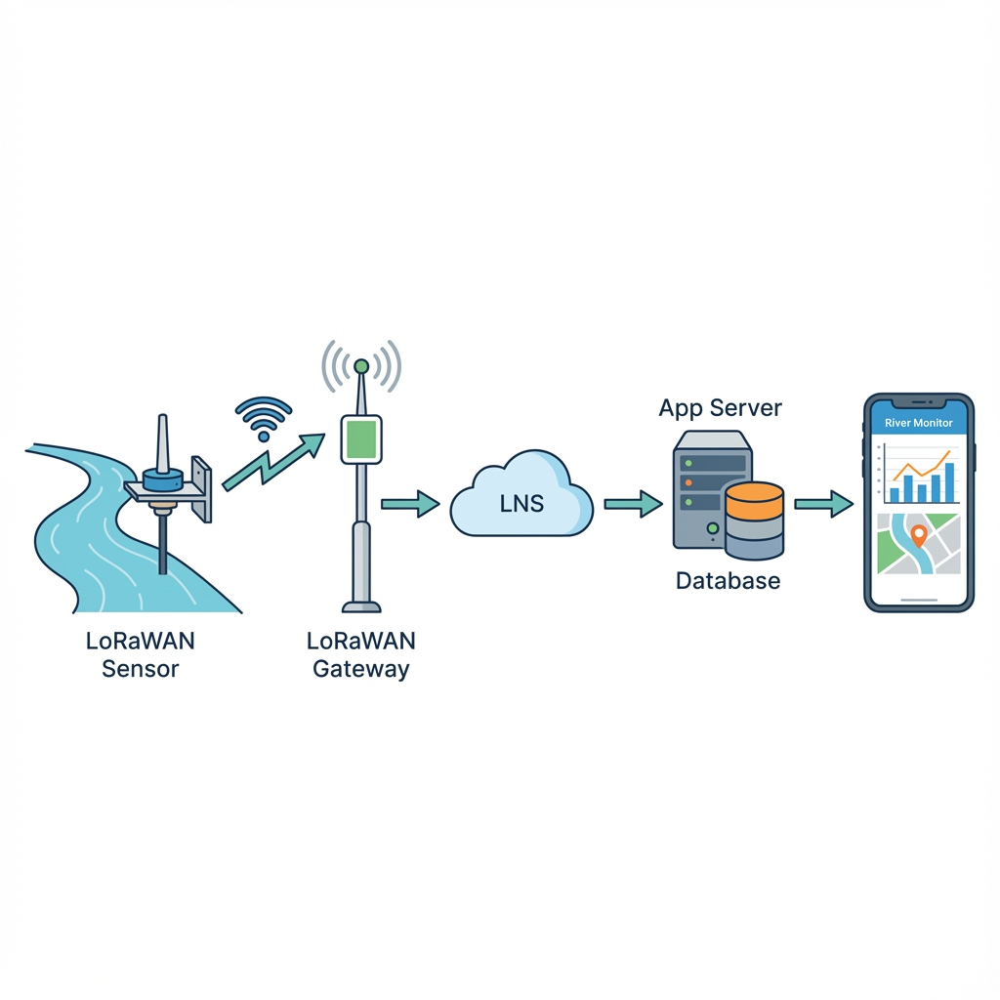
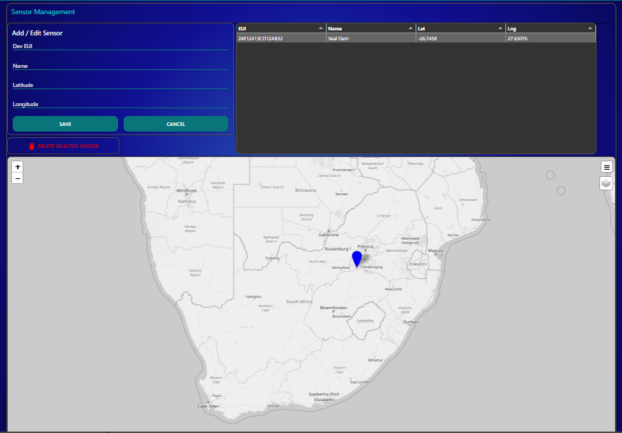

# SA Rivers IoT Monitoring

A comprehensive IoT solution for monitoring river levels using LoRaWAN sensors, Node-RED, Firebase, and Flutter.

## App Preview

## Sensor Device

## Overview

This project collects data from remote sensors (battery, water level, range) via LoRaWAN. The data is processed by a Node-RED backend, enriched with geolocation data from a SQL database, and stored in Firebase Firestore. A Flutter mobile application provides real-time visualization of river levels, historical trends, and sensor locations on a map. Access to the application is secured via Firebase Authentication.

## Architecture

1.  **Sensors**: LoRaWAN devices sending `bat`, `range`, and `interval`.
2.  **Backend (Node-RED)**:
    *   Receives sensor payload.
    *   Queries a SQL database to fetch sensor location (`lat`, `lng`) and name based on the device EUI.
    *   Pushes the enriched data object to Firebase Firestore.
3.  **Database**:
    *   **SQL**: Stores static sensor metadata (Location, Name, EUI).
    *   **Firebase Firestore**: Stores real-time and historical sensor readings.
4.  **Frontend (Flutter)**:
    *   **Dashboard**: List view of rivers/sensors.
    *   **Map**: Interactive map showing sensor locations.
    *   **Details**: Historical graphs (24h, 7d, 30d) and current status.

## Sensor Management (Node-RED)

A dedicated Admin Dashboard is available in Node-RED for managing the sensor network.
*   **Add/Edit Sensors**: Form to register new sensors or update existing ones (EUI, Name, Location).
*   **Sensor List**: View all registered sensors in a sortable table.
*   **Map View**: Visual overview of all sensor locations on an interactive map centered on South Africa.
*   **Database Management**: Tools to initialize and manage the SQL database table.

## Tech Stack

*   **Mobile App**: Flutter (Dart)
*   **Backend Logic**: Node-RED
*   **Real-time DB**: Firebase Firestore
*   **Metadata DB**: SQL (PostgreSQL/MySQL)
*   **Maps**: `flutter_map` (OpenStreetMap)
*   **Charts**: `fl_chart`

## Getting Started

### Prerequisites
*   Flutter SDK
*   Node-RED instance
*   Firebase Project

### Installation
1.  Clone the repository.
2.  Navigate to the `app` directory: `cd app`
3.  Install dependencies: `flutter pub get`
4.  Run the app: `flutter run`

## Project Structure
*   `app/`: Flutter mobile application source code.
*   `back_end/`: Node-RED flows and SQL schemas.
